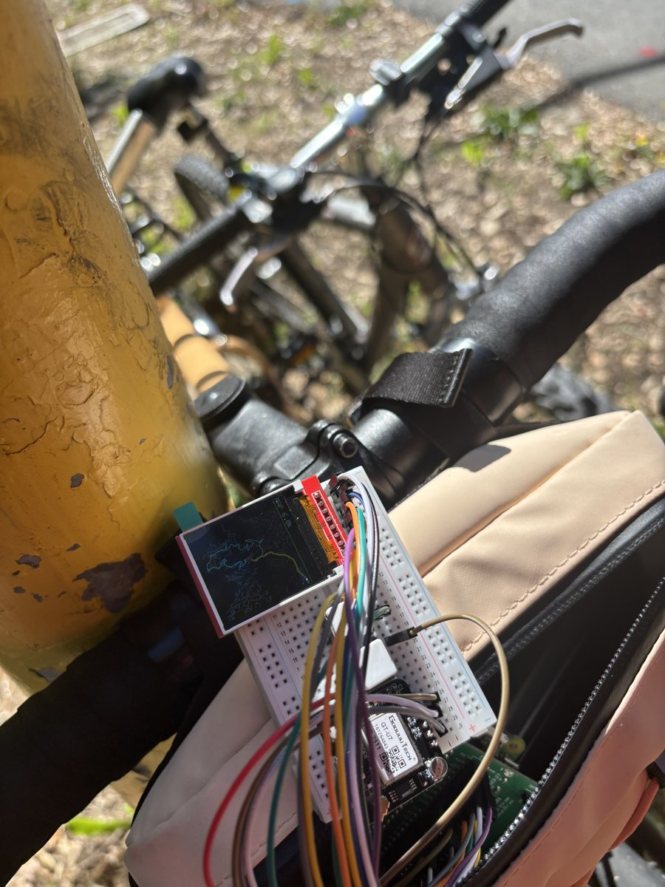
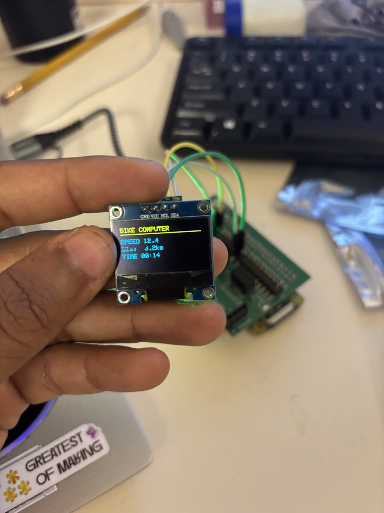
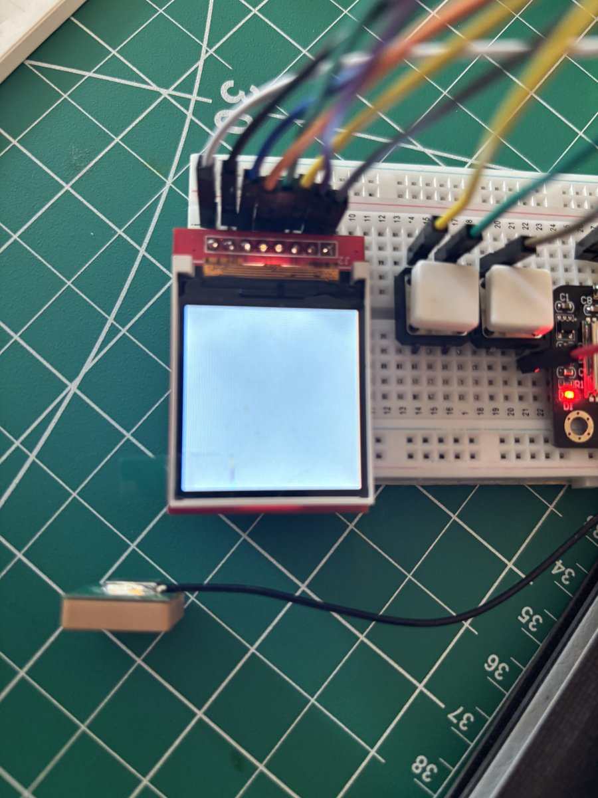
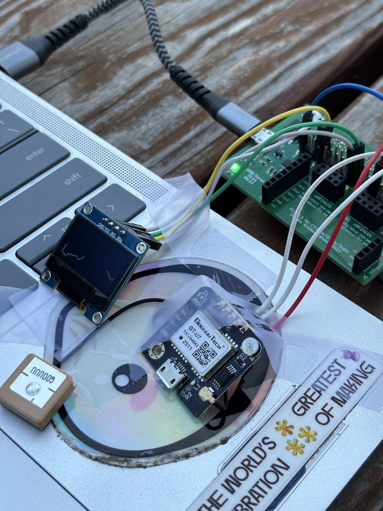
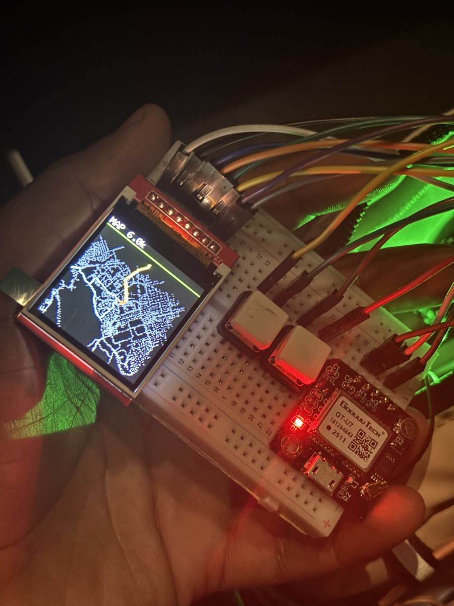
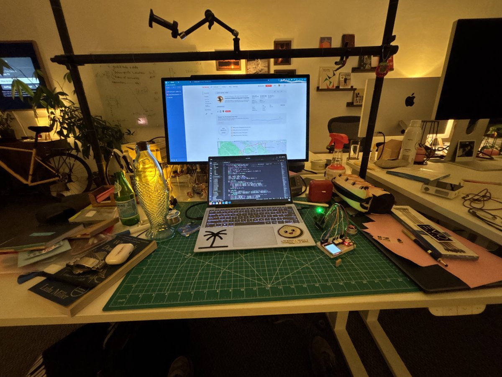
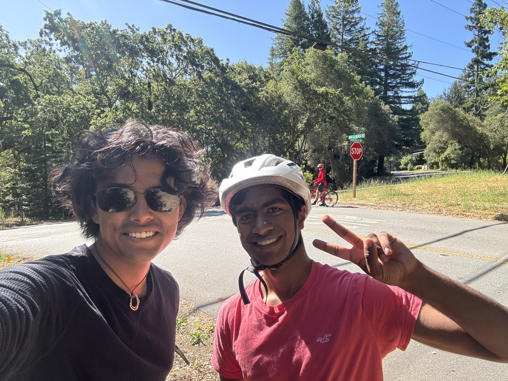
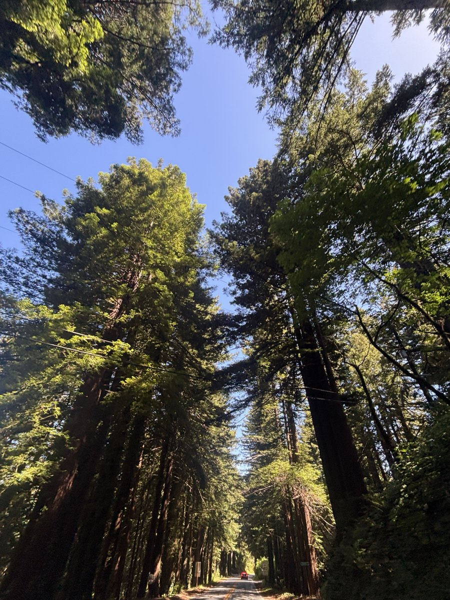

# bare metal bike computer!

this is a self contained GPS bike computer for the raspberry pi, which is my cs240lx final project. it shows live ride stats, a color road map on a tft, and logs the whole ride as a timestamped gpx to the sd card, so you can pull the card and upload it to strava!

ive verified this working on a 23 mile ride over just 3 hours, which had zero corruption! see https://www.strava.com/activities/18830867953

<p align="center">
  
</p>
<p align="center"><em>peak breadboard engineering. it lives on the frame bag.</em></p>

this is roughly a peripherals and also a systems project, as you care a lot about optimizing cpu cycles in the opposite direction! specifically, this uses a gps, a color spi display, sd on bare metal, and its driven mostly with the dma (for both the screen and the sd card), and we use the pmu to check the cycle counts, and chase low power with wfi.

roughly ~4.3k lines of C (plus another ~1.5k of test programs):

```
            bikecomputer.c   (main loop, ride state, UI pages, GPX lifecycle)
            /     |      |        \            \
   gps_nmea  ride/auto  gpx_log   display       dma_irq  (DMA-done IRQ -> wfi)
   (parse)   -pause     (RAM GPX)  abstraction       |
      |                    |       d_*/dcol_t        |
  sw-UART(staff)        fat32_min   /    \        (used by st7735_flush_dma
   GPIO16              (safe write) st7735  ssd1306   and emmc dma mode 3)
                          |        (TFT)   (OLED, fallback)
                        emmc.c (+DMA)
                        (Arasan SDHCI)
```

this was inspired by https://github.com/hishizuka/pizero_bikecomputer!

slides at https://docs.google.com/presentation/d/16DCIUVBeaiG64uW5NP0XSgmRlXVI0VN6gde_-T9v7nI/edit?slide=id.p#slide=id.p

## features

- color ui on an st7735, with 3 pages. stats which has speed/distance/moving time/altitude/max speed/satellites/clock, map which has a map with also the live path and a preset one, and system which has a bunch of debugging information.
- gpx logs to sd via a dma driven emmc write path, we store at 1 hz and then auto flush every 30 seconds, and the on card file is always a valid gpx (eg add the closure to the xml file) so you can always pull it if needed
- implements auto pause! specifically pauses if <2km/h for ~10 seconds, and resumes >3.5 km/h
- first button short cycles pages, held down does a save-now and force-pause. the second button is map zoom
- you can throw ROUTE.GPX on the card which can give you a preset road, and ROADS.BIN which stores a map that is taken from openstreetmaps.

## hardware

| Part | Interface | Pi pins | Role |
| --- | --- | --- | --- |
| Raspberry Pi A+/Zero (ARM1176) | — | — | runs everything bare-metal |
| **ST7735 1.44" 128×128 TFT** | SPI0 | SCK→11, SDA→10, CS→8, A0(DC)→25, RST→24, LED+VCC→3V3 | color UI |
| **NEO-6M GPS** | sw-UART @ 9600 | TXD→GPIO16, VCC→**5V**, GND | position/speed/alt/time |
| Button 1 | GPIO | GPIO21 (pin 40) → GND | short=page / long=save |
| Button 2 | GPIO | GPIO26 (pin 37) → GND (pin 39) | cycle map zoom |
| micro-SD (boot card) | SD/eMMC | internal | GPX storage |

gps is on software uart, and can run on 3v3 instead (ive had sparking in the past but now its fine). theres also support for ssd1306 oled since i didnt have a screen for a bit.

### the hardware graveyard

a surprising amount of this project was hardware dying on me:

- two st7789 240x240 panels, both from a faulty batch. the driver was fine and the panels were just dead. rip.
- the bmp280 barometric sensors had a dead temperature channel across the whole batch. altitude comes from gps/strava now.
- gpio15 on my pi reads no signal even as a plain input (tests/19), which killed the hardware-uart gps plan (more on why that hurts in the power section).

so the ui pivoted st7789 → ssd1306 oled (works, but i2c, no dma) → st7735 (spi, dma, color, the one that shipped). holy clutch.

<p align="center">
  
  
</p>
<p align="center"><em>the oled era, and the st7735's first light. a white rectangle counts as progress.</em></p>

## gps: bit-banging nmea from 1983

the neo-6m streams ascii nmea sentences at 9600 baud, 1 hz bursts. the catch: the bcm2835's two hardware uarts (pl011 + mini-uart) both map onto gpio 14/15, which is the same pair you need for printk debugging. so the gps lives on a bit-banged software uart on gpio16, and every bit is sampled by busy-waiting on the cycle counter.

this has a huge consequence for the whole design, as you have no periodic timer interrupt, ever. a timer irq firing mid-byte would jitter the bit sampling and corrupt the gps stream. the dma-completion irq is the only interrupt the logger runs, and it only fires during the frame-push wfi, never during a gps read.

parsing is checksummed ascii splitting:

1. accumulate bytes until `\n`, verify the `*hh` trailer (xor of everything between `$` and `*`)
2. split on commas. RMC gives fix/lat/lon/speed (in knots!)/course/date-time, GGA gives altitude + satellite count
3. coordinates arrive as `ddmm.mmmm` — degrees AND minutes packed into one number, the classic gotcha. `decimal_degrees = degrees + minutes/60`

<p align="center">
  
</p>
<p align="center"><em>gps cold-start ritual: tape everything to the laptop and go stand outside until the satellites show up.</em></p>

## storage: never touch the FAT

the scary part of logging to the **boot card** is that a bad write to the FAT or directory entries bricks the card and the pi won't boot. the trick is to never write either:

- you preallocate `RIDE.GPX` on a laptop once (2MB of zeros = 6+ hours at 1 hz)
- `fat32_write_into` only ever overwrites the file's *existing* clusters. it never allocates, never mutates the FAT, never touches metadata
- so even a logging bug or yanking power mid-write costs at most the contents of RIDE.GPX, never the filesystem

this invariant is what made it safe to develop the risky dma write path live on the actual boot card. the gpx itself is always a complete file, as the header goes in once, and every 30-second flush rewrites the xml closure after the new trackpoints. pull the card whenever, it parses.

## the render: gps fix → pixels

how a fix becomes a map frame, all the way down:

1. **map data**: `tools/osm2bin.py` preprocesses an openstreetmap extract into `ROADS.BIN`, which is just `nseg` × 16 bytes (two lat/lon float pairs per road segment). my extract is 38,699 segments ≈ 604KB, loaded from sd once at boot.
2. **cull**: before projecting anything, reject segments whose endpoints are both outside a lat/lon bounding box around the view. four float compares per segment skips four mul/divs + clipping for everything off-screen (−36% cycles, measured below).
3. **project**: equirectangular, north-up, centered on you. at city scale the earth is flat enough that `x = (lon−lon₀)·111320·cos(lat)` works, with one `cosf` per frame correcting the longitude shrink. 111320 = meters per degree of latitude.
4. **clip**: reject again in pixel space (both endpoints off the map area).
5. **rasterize**: integer [bresenham](https://en.wikipedia.org/wiki/Bresenham%27s_line_algorithm), one error term decides step-x vs step-y, no floats, no division, which matters on a core where both are expensive. the dashed (roads) / thin (route) / thick (live track) styles all fall out of the same loop.
6. **layer**: gray dashed roads → cyan planned route → yellow live track → red heading arrow (three bresenham lines rotated by gps course).
7. **push**: the 128×128 rgb565 framebuffer gets byte-swapped into a shadow buffer and dma'd over spi0 while the cpu sleeps in `wfi()`, woken by the dma-completion irq.

<p align="center">
  
</p>
<p align="center"><em>the map page at 6k zoom — 38,699 segments culled, projected, and bresenham'd into 128×128 pixels.</em></p>

a full frame is **3.5M cycles (~5ms)** at default zoom. it started at ~36M. how it got there is the systems half:

## dma: two stories, one lesson

both the sd writes and the screen push go through the bcm2835 dma engine. they had very different outcomes, which turned out to be the most interesting measured result in the project.

**the spi frame push (the win).** streaming 32KB of pixels over spi is data-bound, so dma + wfi pays off hugely! cpu blit 33.2M cycles → dma blit **3.84M cycles, ~9× fewer** (tests/22), pixel-identical output. the gotchas are all bcm2835 weirdness, as spi-dma needs a control-word header as the first fifo write (`len<<16 | TA`), and you need a *second* dma channel just draining the rx fifo into nowhere or the whole transfer stalls.

**the sd write path (the non-win).** per-block dma works and is ride-verified. so i built the fancier versions, one whole-transfer dma per flush, then + completion irq + wfi. result: **280M vs 278M cycles. nothing.** the sd flush is latency-bound, as it is dominated by emmc command handshakes and protocol delays, not the data transfer you're offloading.

the lesson: **dma+wfi pays for throughput-bound transfers, not latency-bound ones.** same trick, 9× on one peripheral, 0× on the other, and you can't know which without measuring.

also a bug! my first dma cut stalled at exactly 448/512 bytes. wrong TI bit positions as i had `1<<5`/`1<<6` which sets `DEST_WIDTH=128` and paces the wrong side. the correct bcm2835 bits are `DEST_DREQ=1<<6`, `SRC_DREQ=1<<10`.

## pmu: profile before you optimize

the arm1176 pmu (cycle counter + 2 event counters) drives a live SYS page on the device with loop rate, nmea/flush counters, and the per-frame cycle cost. having the number on screen is what motivated each optimization.

when the map render was slow i profiled it properly (tests/23) instead of guessing, on the real 38,699 segments:

| render | cycles | inst | icache miss | note |
|---|---|---|---|---|
| naive, caches off | 144.4M | 6.26M | — | IPC ≈ 0.04 (!) |
| + lat/lon bbox cull | 88.6M | 3.98M | — | −36%, same 1862 segs drawn |
| naive, icache+BP on | 106.4M | 6.26M | 54 | render fits the 16KB icache |
| **cull + icache** | **62.7M** | 3.98M | 26 | **2.3× total** |

reading the counters taught me more than the speedup did:

- IPC 0.04 happens because libpi runs with the L1 **d-cache off**, so every load goes to sdram. the loop isn't compute-bound, it's stall-bound, which is exactly why skipping work per segment (the cull) is a win.
- `caches_enable()` (icache + branch prediction, legal with the mmu off on armv6) is one line for ~−28% on everything. 54 icache misses on a 144M-cycle run means the render fits entirely in the 16KB icache.
- the d-cache stays off **on purpose** as arm1176 needs the mmu + page tables for it, plus clean/invalidate around every dma buffer. corruption risk on a ride-validated logger for no user-visible win.

both: map frame 36M → 3.5M cycles.

## power: wfi and the wall it hit

`wfi` clock-gates the core until an interrupt is *pending*. the cute trick as we enable the irq at the controller but never `enable_interrupts()`, so cpsr stays masked, and the irq wakes wfi without vectoring to any handler at all. tests/9 measured ~700M busy cycles/s vs ~1.2K asleep.

however, in the real main loop, duty stayed ≈ **99%**. at 9600 baud the software uart has to be awake bit-banging nearly every byte. **the sw-uart is a power floor**, and no amount of dma or wfi elsewhere moves it.

the real fix is the hardware uart (the pl011 fifo receives while the cpu sleeps), but that's the thing gpio15 dying killed. it's the one thing i really wanted that didn't land.

## build & run

run `make`, or `make bikecomputer.bin` to get the kernel.

### running standalone (battery, no laptop)

the pi boots directly from `kernel.img`, so make the app the kernel:

```sh
# standalone (runs on power-up):   cp bikecomputer.bin  <SDCARD>/kernel.img
# dev mode (make/serial flashing): cp bootloader.bin    <SDCARD>/kernel.img
```

### sd card setup (one time)

the logger writes into a **preallocated** file (safe because it never allocates clusters or mutates the FAT, so it can't corrupt the boot card). create it once on a PC:

```sh
dd if=/dev/zero of=<SDCARD>/RIDE.GPX bs=1M count=2     # ~6+ hours at 1 Hz
python3 tools/osm2bin.py                               # -> ROADS.BIN (copy to card)
```

then ride. afterwards, mount the card and upload `RIDE.GPX` to strava.

<p align="center">
  
</p>
<p align="center"><em>it counts. strava says so.</em></p>

## thoughts

- i thought dma could help the sd path. it measured at zero, and it measured 9× on the spi path instead lol
- the map render looked compute-bound (all those float projections) but the pmu said stall-bound, so the right fix was skipping memory traffic, not faster math
- the power work looked done after wfi landed. the duty cycle said 99%, and pointed at the one component (sw-uart) that an interrupt-driven rewrite can't fix, and only different hardware can.

im very happy that the logger is safe **by construction**. it physically cannot write anywhere that bricks the card, which is what let me develop dma writes against my only boot card and then trust the thing on a 3 hour ride.

<p align="center">
  
  
</p>
<p align="center"><em>rigorous validation methodology. test conditions were excellent.</em></p>

deeper writeups with sources are in [docs/](docs/) — [architecture](docs/architecture.md), [gps](docs/gps.md), [storage](docs/storage.md), and [display](docs/display.md). [PROVENANCE.md](PROVENANCE.md) has what's new vs ported vs staff (and how this was built).
